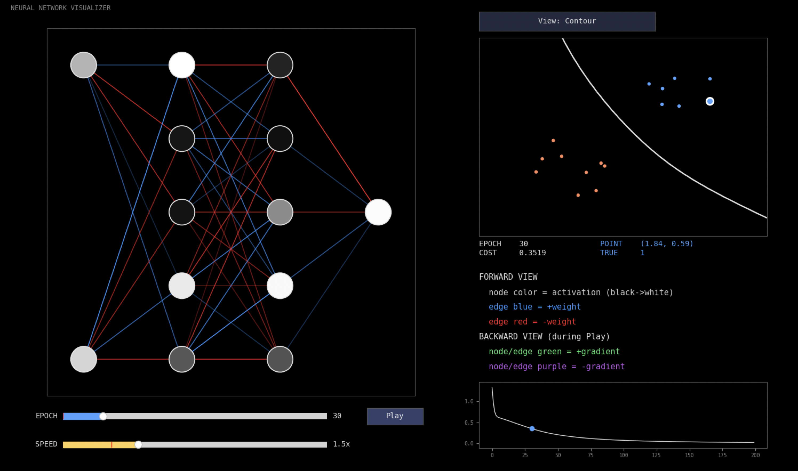

<div align="center">
  
  <h3>A neural network built from scratch in Python: every layer, every gradient, visible.</h3>
</div>

<div align="center">
  
</div>

## Install

```bash
pip install pyedunet
```

## What is this?

Most neural network tutorials hand you a block of code, making you assume that it works. EduNet is built the other way around: every layer, activation and step of backpropagation is written out by hand in plain NumPy, with no framework hiding the math. 

On top of that sits an interactive visualizer, so you can actually **watch** your network learn and iterate learning rates, epoch counts and network layers more intuitively.

**It's built for learning.** All the pieces are visible, swappable, and checkable, so you can see exactly what's happening rather than treating the math as a black box.

## Features

- **The network itself is hand-built** - forward pass, backpropagation, and gradient descent, implemented from scratch, no ML framework underneath
- **Swap components like building blocks** — activation functions (Sigmoid, ReLU, Tanh, Identity) and cost functions (Binary Cross-Entropy, Mean Squared Error) can all be mixed and matched
- **Built-in gradient checking** - verifies your network's math is actually correct, comparing the backprop-computed gradients against an independent numerical estimate
- **Every component can explain itself** — call `.explain()` on any activation or cost function to get its formula, why it's used, and why it's avoided
- **Load and clean real-world data** — a CSV pipeline handles missing values and categorical columns, and turns it into training-ready data in one function call
- **Watch it all happen live** — an interactive visualizer animates the network diagram, decision boundary, and cost curve as it trains, with built-in sample datasets to click through if needed

## Quickstart

Write your own training loop and record it for the visualizer, in only a few compact lines:

```python
from EduNet import NeuralNetworkBinary
from EduNet.visualizer import make_blobs_dataset, TrainingRecorder

X, y = make_blobs_dataset()  # swap in your own (X, y) here
net = NeuralNetworkBinary(n=[2, 5, 5, 1])  # Creating the network
X_train, X_test, y_train, y_test = NeuralNetworkBinary.train_test_split(X, y)

A0, Y, m = net.prepare_data(X_train, y_train)  # Prepare data from dataset
recorder = TrainingRecorder(net, X_train, Y, m)

epochs, alpha = 200, 0.6  # Set epochs and learning rate
for e in range(epochs):
    y_hat, cache = net.feed_forward(A0)
    error = net.cost(y_hat, Y)  # Compute cost

    grads = {}
    propagator = None
    for l in range(net.L, 0, -1):
        dW, db, propagator = net.backprop_layer(l, cache, m, Y, propagator)
        grads[f"W{l}"] = dW
        grads[f"b{l}"] = db

    for l in range(1, net.L + 1):
        net.params[f"W{l}"] -= alpha * grads[f"W{l}"]  # Update weights
        net.params[f"b{l}"] -= alpha * grads[f"b{l}"]  # Update biases

    recorder.capture(cache, grads, error)

recorder.show()  # Display network on the visualizer
```

Or skip straight to watching it happen as a more simple, beginner friendly demo:

```python
from EduNet import demo_vis

demo_vis(architecture=[2, 5, 5, 1], epochs=200, alpha=0.6)
```

Both open the same interactive window at the end - the first shows you (and lets you customize) every step of the loop, the second is the one-line shortcut.

For every activation and cost function, the full `NeuralNetworkBinary` API, and a larger worked example, see [GUIDE.md](GUIDE.md).
