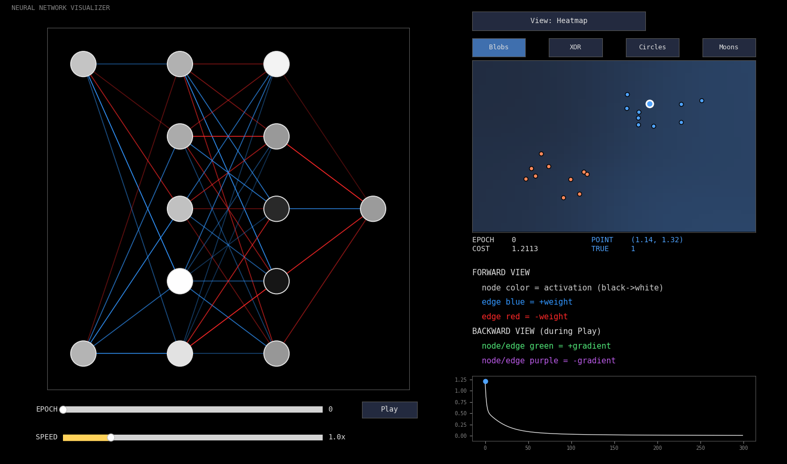
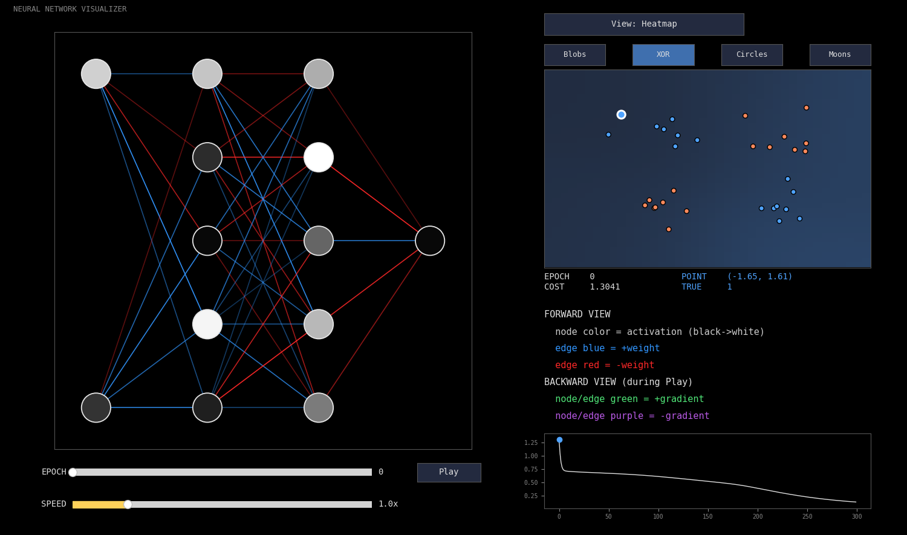
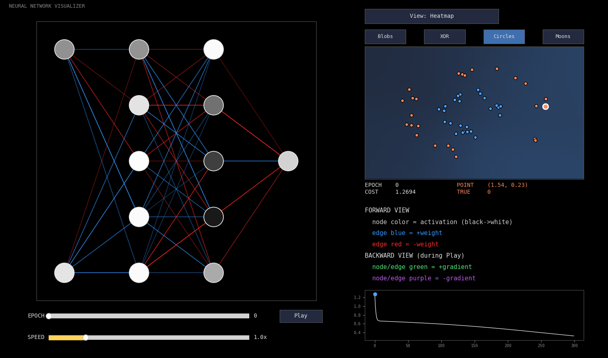
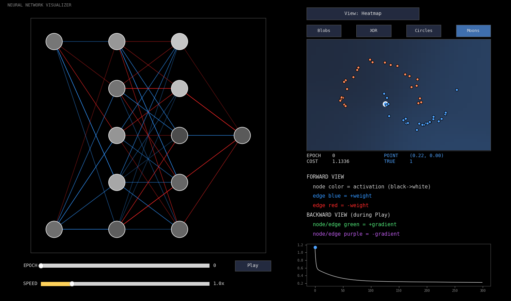

<div align="center">
  
  <h3>A neural network built from scratch in Python — watch it learn, in real time.</h3>
</div>

<div align="center">
  
</div>

## What is this?

Most neural network tutorials just hand you a block of code and tell you it works. EduNet is different — it's a small neural network library, written entirely from scratch in Python, paired with an interactive visualizer that lets you actually **watch** a network learn: the diagram lighting up, the decision boundary forming, the cost dropping — instead of just trusting that it did.

It's built for learning. Every activation function, every cost function, and every step of backpropagation is visible and swappable, so you can see exactly what's happening rather than treating the math as a black box.

## Features

- Build a neural network in a few lines of code
- Swap in different activation functions and cost functions and see how training changes
- Watch training happen live — network diagram, decision boundary, and cost curve, all animated
- Click through built-in sample datasets (Blobs, XOR, Circles, Moons) right inside the window
- Load your own real-world CSV and train on it

## Quickstart

```python
from EduNet import demo_vis

demo_vis(architecture=[2, 5, 5, 1], epochs=200, alpha=0.6)
```

That's it — a window opens, trains the network, and you can scrub through epochs, hit Play to watch it learn, and click between datasets.

## More screenshots

<table>
  <tr>
    <td></td>
    <td></td>
    <td></td>
  </tr>
</table>

## Status

EduNet is still evolving and isn't published on PyPI yet — for now, clone the repo and install it locally:

```bash
git clone https://github.com/azaanyaq/neural-network-scratch.git
cd neural-network-scratch
pip install -e .
```
